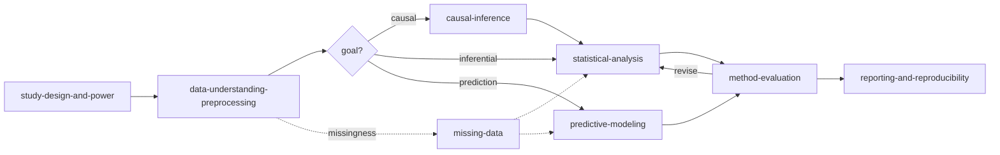

<div align="center">

# 🧬 Biostatistics Superpowers

**Turn your coding agent into a rigorous biomedical statistician** — one that names the estimand
before the model, catches leakage before the split, and refuses to call an association a cause.
<br/>A composable skill suite for **Claude Code** & **OpenAI Codex**.

[](LICENSE)
&nbsp;
&nbsp;
&nbsp;
&nbsp;

[**Features**](#features) · [**Skills**](#the-skills) · [**Demo**](examples/demo/) · [**Install**](#install) · [**Quickstart**](#quickstart)

</div>

---

Coding agents aren't reliably disciplined statisticians. Depending on the model behind it, an agent
asked to "analyze my clinical data" may fit an unadjusted regression and call it causal, dichotomize
a continuous outcome, let the future leak into the past, or report a p-value as if it were the
finding — *sometimes*, with no signal that anything went wrong. Stronger models slip less often;
none slip never — and you can't see which analysis was the miss.

**Biostatistics Superpowers turns your coding agent into a biomedical statistician.** It is a team
of specialist skills — one per phase of a study — behind a single orchestrator, that makes the
agent *think like one*: name the estimand before the model, design before touching data, identify
before estimating, handle missing data honestly, critique itself adversarially (ideally in a fresh
sub-agent), and report so another scientist can reproduce it.

## Current v2 capabilities

This fork's default branch is **`v2`**. It retains the nine original statistical domain skills and adds the **`biostat-workflow`** companion skill, an optional Python workflow controller, persistent project decision memory, and **one local MCP server with 22 tools**. The domain skills provide statistical policy; the runtime records stages, readiness gates, revision/iteration limits and stop reasons. The host agent still performs the analysis and scientific review. Jev is not implemented.

[**Browse the kidney-cancer analysis and figures**](https://avocada.github.io/biostat-superpowers/) · [Architecture and roadmap](docs/modernization/README.md) · [Runtime installation](docs/modernization/INSTALL_V2.md)

| Implemented integration | What is available |
|---|---|
| UCI datasets and local CSV | Fetch Iris and Heart Disease; import explicitly staged CSV files and profile them |
| ClinicalTrials.gov | Search, paginate, retrieve trial details and compare selected records |
| PubMed and Europe PMC | Citation/abstract search, pagination, article records and reference lists; no full-text downloader |
| UniProt | Reviewed human protein lookup, gene/protein identifiers and Reactome cross-references |
| Open Targets | Bounded target tractability and drug/candidate records across indications; not proof of treatment efficacy |
| Vega-Lite | Four local chart templates and rendering; not a searchable copy of the full gallery |
| Project context | Retrieve fingerprint-scoped decisions, propose reviewed handoffs and inspect the audit trail |

Source artifacts retain URLs, dates and checksums. Reactome annotations are not pathway enrichment. ClinVar, gnomAD, GWAS Catalog, GEO, GDC, UCSC, textbooks, ToolUniverse and other catalog links remain **reference-only**, not implemented connectors. See [MCP scope](docs/modernization/MCP_SERVER.md) and [protein/target evidence](docs/modernization/OMICS_MCP.md).

The [kidney-cancer pilot](examples/ccrcc_agent_pilot/README.md) demonstrated real MCP calls and decision reuse, but did not demonstrate token savings or superior numerical results. Scientific inference and its figures ran in local Python. Memory stores selected project decisions; it does not replace the host's conversation management.

### Who it's for

- **You already do biostatistics.** You know the right way — enforcing it on every analysis is the
  tax. This is a collaborator that already knows the playbook: it skips the rookie mistakes, writes
  correct R *and* Python, produces publication- and reproducibility-ready output, and pushes back
  when something is off. You spend your time on judgment, not on catching leakage.
- **You're not a statistician but need to be one** — a clinician, biologist, or data scientist
  doing real biomedical research. The danger isn't the analysis that crashes; it's the one that
  looks fine and is quietly wrong. This makes your agent a statistician that asks the right
  questions, picks the right method, stops the plausible-but-wrong analysis you couldn't see, and
  says plainly when the stakes call for a human expert.

**Biomedical-first, generally useful:** the flagships are clinical and epidemiological (survival,
cohorts, causal effects), but the discipline applies to any quantitative field.

---

## Features

- **Easy to use — just talk to it.** No commands to memorize, no new DSL, no statistics jargon
  required: describe your situation in plain English and the `biostatistics` orchestrator routes you
  to the right specialist. In our demo, a single one-line prompt drove the *entire* analysis. Installation
  can be delegated to your agent using the guide below; the optional MCP runtime requires additional setup.
- **The whole research lifecycle, not one step** — design → data → analysis → causal inference →
  prediction → missing data → method critique → reproducible reporting. One orchestrator routing to
  eight specialist skills.
- **Catches the invisible, fatal mistakes** — data leakage, confounding, immortal-time bias,
  dichotomizing a continuous outcome, calling an association causal: the errors that look fine and
  sink papers.
- **Causal inference and adversarial self-critique are first-class**, not afterthoughts — DAGs,
  propensity scores / IPTW / doubly-robust estimation, E-values; an independent fresh-context
  reviewer and an explicit readiness rating.
- **Cross-platform and bilingual** — the same `SKILL.md` files run on **Claude Code** and **OpenAI
  Codex**, and it writes both **R and Python**.
- **Verifiable, not "trust me"** — a reproducible demo on data with an *injected* ground truth, raw
  per-use-case transcripts, a routing log, and a reviewer evidence checklist. You can check every claim.
- **Publication-ready and reproducible by default** — effect sizes with confidence intervals over
  bare p-values, CONSORT/STROBE/TRIPOD-aligned reporting, set seeds, environment lockfiles, and a
  data/code-availability statement.

---

## Why this exists

Most "statistics for agents" tools are a single skill that fits a model and prints a table.
That is the easy 20%. The hard 80% of real research is everything *around* the model:

- choosing an **estimand** and a study **design** before touching data,
- catching **leakage**, eligibility, and time-zero problems before splitting,
- knowing when an association can carry a **causal** interpretation and when it cannot,
- handling **missing data** honestly instead of dropping rows,
- **critiquing** whether the chosen method is even appropriate, and
- reporting in a way another scientist can **reproduce**.

Biostatistics Superpowers encodes that discipline. Its differentiators:

- **Full research lifecycle**, not a single step — design → data → analysis → causal / prediction → missing → critique → reporting.
- **Causal inference and method critique as first-class skills**, not afterthoughts (DAGs, target-trial emulation, E-values; an adversarial "is this method appropriate?" reviewer with a readiness rating).
- **Cross-platform from day one** — the same skills run on Claude Code *and* Codex (and other agents that read the open `SKILL.md` standard).
- **R *and* Python** reference implementations throughout.
- **Built on serious sources** — Harrell, Gelman/Hill/Vehtari, Hernán & Robins, van Buuren, Hastie/Tibshirani/Friedman, and the relevant reporting guidelines.

---

## The research arc

The `biostatistics` orchestrator routes work along this arc. It is not strictly linear — it
loops back (e.g. a leakage finding sends you back to design) and branches (observational data
activates causal inference).



---

## The skills

| Skill | What it does |
|-------|--------------|
| **`biostatistics`** | **Orchestrator.** Reads the research situation and routes to the right specialist skill(s). Start here. |
| **`study-design-and-power`** | Frame the question (PICO + estimand), choose a design (RCT / cohort / case-control / cross-sectional), plan sample size & power, anticipate bias, pre-register, pick a reporting guideline. |
| **`data-understanding-preprocessing`** | Profile and validate a dataset; assign variable roles/types; assess missingness & outliers; check leakage; define eligibility, time-zero, and the analysis table; design leakage-safe splits. |
| **`statistical-analysis`** | Fit and interpret the right model in **R or Python** — linear / logistic / Poisson / ordinal / survival / mixed / GEE — with diagnostics, confidence intervals, sensitivity checks, and reproducible scripts. |
| **`causal-inference`** | Estimate effects from observational data: DAGs, confounding vs colliders vs mediators, estimands, propensity scores / IPTW / matching, doubly-robust estimation, DiD / IV / RD, target-trial emulation, and E-value sensitivity. |
| **`predictive-modeling`** | Build and validate a prediction/prognostic model — a clinical prediction model (TRIPOD) or any score-optimization task: leakage-safe cross-validation, regularization & ensembles, discrimination **and** calibration, internal (bootstrap) + external validation. |
| **`missing-data`** | Diagnose MCAR / MAR / MNAR, choose complete-case vs multiple imputation (`mice` / scikit-learn), apply Rubin's rules, and run MNAR sensitivity analyses. |
| **`method-evaluation`** | The adversarial reviewer. Critiques assumptions, diagnostics, robustness, and fair comparison; assigns a **readiness rating** and emits a structured evaluation report. |
| **`biostat-workflow`** | Optional companion for executable stage gates, project memory, MCP provenance and reviewed handoffs. Requires the separately installed runtime for those capabilities. |
| **`reporting-and-reproducibility`** | Produce Table 1, effect sizes with CIs (not just p-values), CONSORT / STROBE / TRIPOD-aligned reporting, figures, and a reproducible project (seeds, `renv` / `targets`, session info, data/code availability). |

Each skill is a folder under [`skills/`](./skills/) containing a `SKILL.md` plus references,
templates, and runnable scripts.

## Architecture

A single **orchestrator** skill (`biostatistics`) is the entry point: it reads the request,
classifies the goal, names the estimand, and routes to one or more **specialist** skills — each a
self-contained `SKILL.md` (a workflow plus when-to-read references) following the open Agent Skills
standard. Three design choices make it work:

- **Orchestrator + composable specialists.** No monolithic mega-prompt; each skill is small,
  independently invocable, and cross-links to the others, so the agent loads only what the task
  needs (*progressive disclosure* — references, templates, and scripts are read on demand).
- **Discipline encoded as instructions.** The skill asks the host agent to follow an order (define → prepare →
  identify → fit → critique → report) and hard guard rails (no causal claim without identification,
  no leakage, effect sizes over p-values). The optional v2 controller makes stage transitions and stopping policies executable; it does not independently certify scientific correctness.
- **Cross-platform by construction.** Plain `SKILL.md` files are discovered natively by Claude Code
  (as a plugin) and by Codex (via its skills directory), and by any agent that reads the standard;
  the skills are written tool-agnostically so the same files run on each.

---

## Install

**Use this fork (`Avocada/biostat-superpowers`, branch `v2`) for the new capabilities.** The original upstream installation commands install a different checkout.

### Let your agent install it

For Codex, paste:

> Fetch `https://raw.githubusercontent.com/Avocada/biostat-superpowers/v2/.codex/INSTALL.md` and install the skills plus the optional workflow, memory and MCP runtime. Preserve any existing domain-skill installation.

For Claude Code, use the same request with [`.claude/INSTALL.md`](https://raw.githubusercontent.com/Avocada/biostat-superpowers/v2/.claude/INSTALL.md).

### Fresh Codex installation (macOS/Linux shell)

Requires Git, Python **3.10+** and the Codex CLI. This command links all ten skills; if you already have the original domain skills, use the [existing-installation instructions](docs/modernization/INSTALL_V2.md#existing-domain-skill-installation) instead.

```sh
BIOSTAT_DIR="$HOME/.codex/biostat-superpowers-v2"
git clone --branch v2 https://github.com/Avocada/biostat-superpowers.git "$BIOSTAT_DIR"
bash "$BIOSTAT_DIR/install.sh" codex
python3 -m venv "$BIOSTAT_DIR/.venv"
"$BIOSTAT_DIR/.venv/bin/python" -m pip install -e "${BIOSTAT_DIR}[mcp]"
codex mcp add biostat -- "$BIOSTAT_DIR/.venv/bin/biostat-mcp" --artifact-dir "$BIOSTAT_DIR/outputs/mcp"
codex mcp list
```

The skills-only installer creates links; it **does not install Python dependencies or register MCP**. Start a fresh agent session after setup. Use `biostat-workflow` alongside `biostatistics` to request runtime use. Built-in public-source connectors do not require API keys; network access and provider limits still apply.

### Claude Code

```text
/plugin marketplace add Avocada/biostat-superpowers
/plugin install biostat-superpowers@biostat-superpowers
```

The fork currently defaults to `v2`. If an upstream marketplace with the same name is already installed, check its source before installing; see [Claude setup](.claude/INSTALL.md). The plugin supplies skills; follow [runtime setup](docs/modernization/INSTALL_V2.md) separately for Python dependencies and MCP registration.

### Update an existing v2 runtime

```sh
BIOSTAT_DIR="$HOME/.codex/biostat-superpowers-v2"
git -C "$BIOSTAT_DIR" remote get-url origin
git -C "$BIOSTAT_DIR" status --short
git -C "$BIOSTAT_DIR" switch v2
git -C "$BIOSTAT_DIR" pull --ff-only origin v2
"$BIOSTAT_DIR/.venv/bin/python" -m pip install -e "${BIOSTAT_DIR}[mcp]"
```

Check that the remote is your intended fork and preserve local edits before updating. Existing symlinks and MCP registration still work when paths are unchanged; restart the server/session to load new code. See [complete setup, verification and removal](docs/modernization/INSTALL_V2.md).

---

## Quickstart

Once installed, just describe your situation in natural language. The orchestrator takes it from
there.

```
> I have an observational EHR cohort and want to estimate whether drug A reduces 1-year
  mortality vs drug B. Where do I start?

> Critique this analysis: we ran a logistic regression of mortality on treatment with no
  adjustment and concluded the drug works.

> Help me compute the sample size for a two-arm RCT with a binary primary outcome.

> 30% of my key covariate is missing. What should I do?
```

**Force a specific skill** — name it directly instead of letting the orchestrator route:

```
> Use the `causal-inference` skill to pick an adjustment set for this DAG.
> Run `method-evaluation` on this propensity-score analysis (in a fresh sub-agent).
> /biostat emulate a target trial for metformin vs sulfonylurea on MACE   ← bundled command (Claude)
```

**Drive a goal with `/goal`.** Claude and Codex can pursue a goal until it is met; the suite is
built to ride that loop — especially for iterative model optimization, done without fooling
yourself:

```
> /goal Use the `predictive-modeling` skill to raise nested-CV AUROC for 30-day readmission to
  ≥ 0.80 without leakage. Keep a final test set untouched until the end; stop after three flat rounds.
```

Worked examples:

- [**Live kidney-cancer proteogenomics report**](https://avocada.github.io/biostat-superpowers/) — paired RNA/protein analysis, source evidence, figures and early-stage sensitivity.
- [RHC agent pilot](examples/rhc_agent_pilot/README.md) — causal-analysis workflow, provenance and fresh-session continuation.

- **[`examples/demo/`](./examples/demo/) — flagship.** A real agent, given a *one-line plain-English
  prompt* and a cohort with a **hidden, injected ground truth**, autonomously ran the whole pipeline
  and recovered it: it flipped a naively "harmful" drug to its true protective effect and reported an
  honest AUC instead of a leakage-inflated one — with the figures it drew. Reproducible in one command.
- [`examples/transcripts/`](./examples/transcripts/) — **raw transcripts** of the skill answering five
  different users (a biostatistician's plan critique, a clinician's analysis plan, a "is this OK to
  submit?" triage). Judge it on your kind of problem; rerun the prompts yourself.
- [`examples/observational-cohort-study.md`](./examples/observational-cohort-study.md) — a full causal study, question to report.
- [`examples/goal-driven-optimization.md`](./examples/goal-driven-optimization.md) — `/goal`-driven model optimization with anti-overfitting guard rails.

---

## What this is — and isn't

- **It is** a methodology layer: it makes your agent *think* like a biostatistician and write
  correct, reproducible R/Python.
- **It is not** a replacement for a qualified statistician on consequential work (regulatory
  submissions, primary trial analyses). It is a force-multiplier and a guardrail, and it will
  tell you when a question is out of its depth.
- It does **not** execute code on your behalf unless your agent is set up to run R/Python; it
  writes the code and explains what to run.
- **No warranty; not medical or regulatory advice.** Released under the MIT license, as-is. It does
  not replace the statistical review, ethics/IRB approval, or regulatory rigor that consequential
  biomedical work requires — and, like any LLM tool, it can be wrong, so check what matters.

---

## Requirements

The skills generate code; you run it. Reference implementations assume:

- **R** (≥ 4.1): `stats`, `survival`, `lme4`, `MASS`, `mice`, `MatchIt`, `WeightIt`, `sandwich`,
  `gtsummary`/`tableone`, `dagitty`, `pwr`, `tidymodels`/`glmnet`, `rms` — installed as needed.
- **Optional workflow/MCP runtime:** Python ≥ 3.10; install the `[mcp]` extra as shown above. R and analysis packages remain separate.
- **Python analysis** (≥ 3.9): `pandas`, `numpy`, `statsmodels`, `lifelines`, `scikit-learn`. Optional:
  `dowhy`, `econml`, `zEpid`.

Every script checks for and reports missing packages instead of silently installing them.

---

## Contributing

New skills, better references, more languages, and bug fixes are all welcome — see
[CONTRIBUTING.md](./CONTRIBUTING.md). The cardinal rules: write `SKILL.md` in **tool-agnostic**
language so it runs on any agent, and keep statistical claims **defensible and sourced**.

## Contributors

Amiee Huang, Shuang Song, and Zongxin Yang — equal contribution.

## License

[MIT](./LICENSE).

## Acknowledgements

Architecture inspired by [Superpowers](https://github.com/obra/superpowers) by Jesse Vincent,
which pioneered the cross-platform, orchestrator-plus-skills pattern this project follows.
