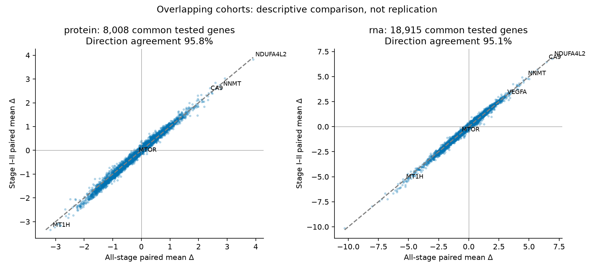
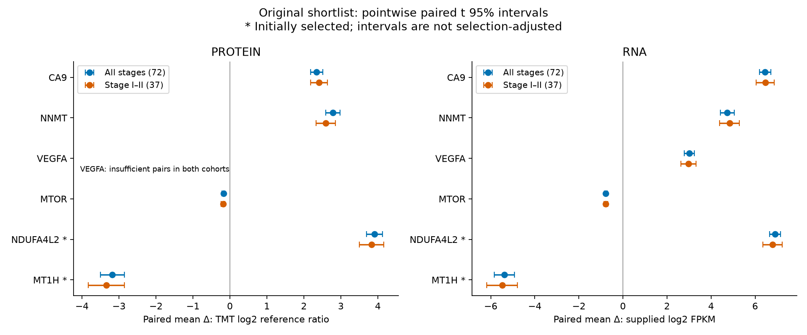

# Stage I–II sensitivity and bounded trial context

The original paired molecular shortlist persists descriptively in the Stage I–II subset: CA9 and NNMT increase in both layers, MTOR decreases in both, and VEGFA increases in RNA but remains unevaluable in protein. Reapplying the original exploratory selection rule again selects NDUFA4L2 and MT1H in both cohorts. This is an overlapping-cohort sensitivity analysis, not independent replication or proof of robustness, stage interaction, or clinical benefit.

## Input integrity and cohort

All nine input file SHA256 hashes and byte counts match the original manifest. Combined fingerprint: `ff08dba38c4df7e1f899b4ebecb713f6aa49d24cb074d9f9c30478a1e1571f0f`. The original all-four-assay cohort was reconstructed under the saved histology and contaminated-normal exclusions, and its size verified as 72. Authoritative `input/clinical_annotation.csv`, field `Tumor_Stage_Pathological`, supplies exact Stage I/Stage II eligibility; no older CLI staging was used. Stage I: 28; Stage II: 9; Stage III: 23; Stage IV: 12; missing/unknown stage: 0. The early-stage cohort contains 37 original cases, excluding 35 Stage III–IV cases. No cases were added from layer-specific cohorts.

## Estimator and changing testing families

The estimand is the mean within-case tumor-minus-normal difference in the selected cohort, estimated from each gene’s available finite pairs. Protein remains supplied processed TMT log2 reference ratios; RNA remains supplied log2 FPKM. No re-log, cross-layer subtraction, imputation, covariate adjustment or outlier removal. Exact original `analyze` and `bh` functions were extracted from `analysis.py` without executing its top-level analysis. Eligibility now requires both ≥80% finite pairs within the respective cohort and ≥20 pairs: 58/72 all-stage and 30/37 early-stage. Ineligible genes retain descriptive values where available but have no p/q/interval. Zero-variance differences have undefined inference and are excluded from BH.

Two-sided paired t tests and pointwise 95% t intervals use the sample SD of paired differences, SE = SD/√n and n−1 degrees of freedom. BH is recomputed separately for each of four layer/cohort families over valid retained p-values. Intervals are model-based, not simultaneous or selection-adjusted; they assume independent cases and approximately normal sampling of the mean. BH control relies on its usual dependence conditions; arbitrary gene dependence is not guaranteed to satisfy them.

| Cohort | Layer | Cases | Min pairs | Input genes | Pass completeness | BH family | Zero variance | q<0.05 |
| --- | --- | --- | --- | --- | --- | --- | --- | --- |
| all_stage | protein | 72 | 58 | 11710 | 8054 | 8054 | 0 | 6838 |
| all_stage | rna | 72 | 58 | 19275 | 19275 | 19015 | 260 | 15118 |
| early_stage | protein | 37 | 30 | 11710 | 8087 | 8087 | 0 | 6436 |
| early_stage | rna | 37 | 30 | 19275 | 19275 | 18915 | 360 | 14077 |

The original ≥20-pair protein family contained 10,033 tests; the fair all-stage comparator now contains 8,054. All-stage means are numerically unchanged, but protein BH q-values change with the smaller family. RNA all-stage inference is unchanged. Protein has 46 tested genes unique to all-stage and 79 unique to early-stage; 100 RNA genes become constant and untestable in early-stage. Cohort-specific completeness can therefore retain more protein genes in the smaller cohort. These family changes and reduced sample size/power preclude reading significance changes as biological differences.

## Direction and ranking comparisons

| Layer | Common tested | Same direction | Signed-effect Spearman | Absolute-effect Spearman | Top-50 overlap | q<.05 all only | q<.05 early only |
| --- | --- | --- | --- | --- | --- | --- | --- |
| protein | 8008 | 95.8% | 0.990 | 0.971 | 42/50 | 562 | 138 |
| rna | 18915 | 95.1% | 0.987 | 0.968 | 47/50 | 1490 | 449 |

Rank correlations use genes tested in both cohorts; absolute-effect ranks in the full tables use each cohort’s own tested family, descending absolute mean difference with gene-name tie-breaks. Top-50 overlap compares each family’s top 50. Significance-transition counts above concern only common tested genes. Correlations are descriptive, with no gene-independent p-values: genes are correlated and the cohorts share 37 cases. Difference in significance is not a test of interaction; no independent-cohort or all-versus-subset difference test was run.

RNA/protein direction agreement within each cohort is 5,859/7,638 (76.7%) all-stage and 5,804/7,670 (75.7%) early-stage. These use different jointly tested gene sets and available pairs and are not a biological change estimate. RNA is finite for every case; protein completeness can still select case subsets.

## Prespecified genes and original exploratory shortlist

CA9, NNMT, VEGFA and MTOR are the four user-prespecified genes. NDUFA4L2 (verified current symbol COXFA4L2) and MT1H were selected in the initial data and remain exploratory. The unchanged selection rule uses protein q<0.05, ≥90% finite pairs, an available RNA test, then descending absolute protein mean difference; excludes the four prespecified genes. The ≥90% cutoff is 65 all-stage and 34 early-stage pairs. No drug or RNA-direction selection filter was introduced.

| Gene | Layer | Cohort | Pairs | Mean Δ | 95% paired CI | BH q | Absolute rank |
| --- | --- | --- | --- | --- | --- | --- | --- |
| CA9 | protein | all_stage | 72 | 2.34 | 2.18 to 2.51 | 1.35e-38 | 26 |
| CA9 | protein | early_stage | 37 | 2.41 | 2.18 to 2.64 | 7.07e-20 | 26 |
| CA9 | rna | all_stage | 72 | 6.45 | 6.2 to 6.71 | 1.23e-54 | 8 |
| CA9 | rna | early_stage | 37 | 6.46 | 6.04 to 6.87 | 1.48e-25 | 10 |
| NNMT | protein | all_stage | 72 | 2.78 | 2.59 to 2.98 | 1.35e-38 | 10 |
| NNMT | protein | early_stage | 37 | 2.59 | 2.33 to 2.86 | 3.79e-19 | 17 |
| NNMT | rna | all_stage | 72 | 4.74 | 4.42 to 5.06 | 5.68e-40 | 44 |
| NNMT | rna | early_stage | 37 | 4.84 | 4.39 to 5.29 | 9.61e-21 | 45 |
| VEGFA | protein | all_stage | 1 | 1.07 | — to — | — | — |
| VEGFA | protein | early_stage | 0 | — | — to — | — | — |
| VEGFA | rna | all_stage | 72 | 3.01 | 2.78 to 3.24 | 1.53e-36 | 195 |
| VEGFA | rna | early_stage | 37 | 2.97 | 2.63 to 3.31 | 6.37e-18 | 221 |
| MTOR | protein | all_stage | 72 | -0.175 | -0.212 to -0.137 | 1.36e-13 | 5.19e+03 |
| MTOR | protein | early_stage | 37 | -0.188 | -0.241 to -0.135 | 5.09e-08 | 5.21e+03 |
| MTOR | rna | all_stage | 72 | -0.778 | -0.844 to -0.713 | 5.91e-34 | 3.61e+03 |
| MTOR | rna | early_stage | 37 | -0.775 | -0.86 to -0.69 | 1.63e-18 | 3.76e+03 |
| NDUFA4L2* | protein | all_stage | 72 | 3.91 | 3.69 to 4.13 | 3.84e-43 | 1 |
| NDUFA4L2* | protein | early_stage | 37 | 3.83 | 3.5 to 4.16 | 9.16e-21 | 1 |
| NDUFA4L2* | rna | all_stage | 72 | 6.91 | 6.66 to 7.16 | 3.02e-57 | 6 |
| NDUFA4L2* | rna | early_stage | 37 | 6.79 | 6.35 to 7.23 | 1.71e-25 | 6 |
| MT1H* | protein | all_stage | 72 | -3.18 | -3.51 to -2.85 | 5.5e-29 | 2 |
| MT1H* | protein | early_stage | 37 | -3.34 | -3.83 to -2.86 | 4.04e-15 | 2 |
| MT1H* | rna | all_stage | 72 | -5.39 | -5.84 to -4.93 | 8.28e-34 | 24 |
| MT1H* | rna | early_stage | 37 | -5.48 | -6.18 to -4.79 | 1.01e-16 | 25 |

*Initially data-selected. All tested shortlist effects retain direction and q<0.05. CA9 protein rank stays 26; NNMT changes 10→17. NDUFA4L2 and MT1H remain protein ranks 1 and 2. MTOR’s decrease is total abundance, not a measurement of kinase activity. VEGFA protein n=1 all-stage and n=0 early-stage: no valid paired inference. Protein and RNA differences have distinct supplied scales and must not be compared as identically calibrated quantities.

Leave-one-pair-out shortlist mean ranges preserve all tested directions (saved in shortlist_comparison.csv). Several early-stage RNA paired-difference distributions are strongly skewed (CA9 −4.05, VEGFA −3.99, NDUFA4L2 −3.40); t intervals remain the prespecified model-based intervals, but finite-sample coverage is not guaranteed. Direction stability under one deletion does not validate interval coverage or remove selection bias. Further resampling/orthogonal validation would be useful before stronger claims.

## Registered trial context: two bounded concepts

Retrieved 2026-09-24 UTC directly from ClinicalTrials.gov API v2. Exactly two new requests: kidney cancer with `CA9 OR girentuximab` (49 records) and kidney cancer with `NNMT OR "nicotinamide N-methyltransferase"` (1 record). Each was capped at 50; neither response had another page. All-field search hits are not necessarily target-directed trials. Agent naming was grounded in cached CA9 Open Targets/literature and intervention fields; no guessed NNMT drug aliases. Six illustrative records were reviewed below; remaining hits are archived without target/efficacy adjudication.

| Registry | Purpose | Phase | Status as retrieved | Last update posted | Status verified | Results posted |
| --- | --- | --- | --- | --- | --- | --- |
| [NCT05663710](https://clinicaltrials.gov/study/NCT05663710) | TREATMENT | PHASE1, PHASE2 | RECRUITING | 2026-07-30 (ACTUAL) | 2026-04 | False |
| [NCT07197580](https://clinicaltrials.gov/study/NCT07197580) | TREATMENT | PHASE3 | RECRUITING | 2026-04-01 (ACTUAL) | 2026-03 | False |
| [NCT00087022](https://clinicaltrials.gov/study/NCT00087022) | TREATMENT | PHASE3 | COMPLETED | 2018-11-27 (ACTUAL) | 2018-10 | True |
| [NCT05239533](https://clinicaltrials.gov/study/NCT05239533) | TREATMENT | PHASE2 | ACTIVE_NOT_RECRUITING | 2026-01-14 (ACTUAL) | 2026-01 | False |
| [NCT03849118](https://clinicaltrials.gov/study/NCT03849118) | DIAGNOSTIC | PHASE3 | COMPLETED | 2024-05-17 (ACTUAL) | 2024-05 | True |
| [NCT01144169](https://clinicaltrials.gov/study/NCT01144169) | TREATMENT | PHASE1 | TERMINATED | 2016-10-26 (ESTIMATED) | 2016-10 | False |

**NCT05663710** — Treatment: 177Lu-girentuximab combined with cabozantinib and nivolumab in advanced ccRCC. Combination study does not isolate the effect of CA9 targeting; no posted results in this snapshot.

**NCT07197580** — Treatment: advanced relapsed/recurrent ccRCC. Registry intervention explicitly verifies 177Lu-TLX250 as 177Lu girentuximab tetraxetan. Phase 3/recruiting is development status, not demonstrated efficacy; no posted results in this snapshot.

**NCT00087022** — Treatment: randomized adjuvant girentuximab versus placebo after surgery for nonmetastatic kidney cancer. Completed phase 3 and posted results do not establish benefit; no efficacy extraction or new efficacy claim made here.

**NCT05239533** — Treatment: 177Lu-girentuximab plus nivolumab; also includes diagnostic 89Zr-girentuximab scans. The diagnostic component must not be described as treatment. No posted results in this snapshot.

**NCT03849118** — Diagnostic imaging: ZIRCON uses 89Zr-girentuximab PET/CT. The registry intervention explicitly lists 89Zr-TLX250 as another name. Reused ZIRCON literature concerns this same trial, not an additional independent study. No therapeutic efficacy conclusion.

**NCT01144169** — NNMT is a secondary serum biomarker outcome in a hydroxychloroquine study, not a verified drug target. Terminated for accrual barriers (surgery delay/additional visits), not a reported efficacy failure. No posted results. This is not evidence of an NNMT-targeting therapy.

The NNMT hit lists nicotinamide N-methyltransferase among secondary serum biomarker outcomes. Hydroxychloroquine was not verified as an NNMT-targeting agent and is not presented as one. No verified NNMT-targeting kidney treatment trial was identified in this bounded search; that is not proof none exist. Registry statuses are sponsor-reported snapshots and may be stale (especially older records); dates are preserved exactly. Phase, recruitment status and posted-results flags are not efficacy evidence. Diagnostic imaging localization does not establish therapeutic benefit. Advanced-disease combination trials cannot validate treatment response in these early-stage tissue samples. No efficacy estimates were newly extracted.

## Reuse, reruns and continuation

Reused without new literature/annotation requests: DECISIONS.md, analysis_config.json, original estimator/BH function bodies from analysis.py, original results.json shortlist, report.md and method_review.json limitations; cached UniProt identities/pathways, Open Targets candidate records and evidence_records.json interpretations. Source URLs, original retrieval timestamps and hashes are carried into context_sources.json. Original source-response hashes were verified before reuse. Existing literature remains abstract-level where originally documented, with unresolved cohort overlap; ZIRCON reanalysis is not a new independent trial. No new annotation, pathway-enrichment, or efficacy claim was added.

Rerun: nine input hash/byte checks and combined fingerprint; reconstruction of original cross-modal cases; authoritative stage restriction; paired summaries/t inference under each cohort’s completeness rule; all four BH families; direction/rank/selection comparisons; shortlist leave-one-out/skewness diagnostics; two registry API requests and six record reviews; two comparative figures and offline report. Initial layer-specific sensitivity, initial bootstrap analysis, initial plots and full initial analysis were not rerun. Original all-stage estimates were compared numerically to saved outputs.

Original files are enumerated in followup_outputs/original_hashes.json; final verification checks them byte-for-byte, including report.html, results.json, figures, config, code, raw data and source snapshots. Both new PNGs were opened and visually inspected for labels, intervals, missing VEGFA inference and cohort comparison. This is same-agent verification, with independent review still pending; no scientific/human approval is claimed.

Reproduce using `/tmp/biostat-rhc-analysis-env/bin/python followup_analysis.py`, then `followup_trials.py`, then `followup_report.py` in this folder. The trial script reuses saved followup_sources responses on rerun (no silent status refresh). The analysis script refuses changed original artifacts or inputs. followup_results.json stores cohorts, summaries, full-precision shortlist estimates and methods; followup_outputs contains complete gene tables, comparisons and diagnostics. context_sources.json stores requests, source hashes, full returned record metadata, reviewed relevance and reused sources. followup_outputs/validation.json records checks. No dependencies installed, delegation, runtime, MCP, SQLite or other-arm reads.

## Unresolved limitations and review priorities

Selection is explicit: availability of all four assays, finite protein pairs, pathological stage and data-selected shortlist can each alter the population represented. Missingness may depend on abundance (MNAR); 80% completeness does not solve this. Adjacent tissue is not healthy-donor kidney. Purity/cell composition, stage-associated case mix and tissue-confounded batch/processing may explain contrasts. Processed input scales and raw processing were not re-audited. Sample size and families changed, and the nested samples mechanically favor concordance. No stage interaction, equivalence or robustness proof follows. Independent specimens, assay specificity/localization checks, defensible missingness sensitivity and fuller batch/provenance review remain research priorities. Registry results and full texts need separate appraisal before translational decisions. These outputs are bounded exploratory associations, not causal, predictive or clinical efficacy findings.
