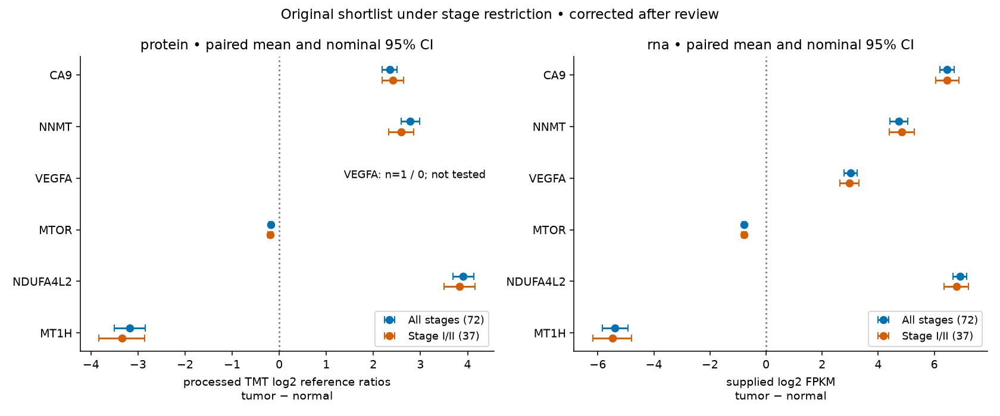
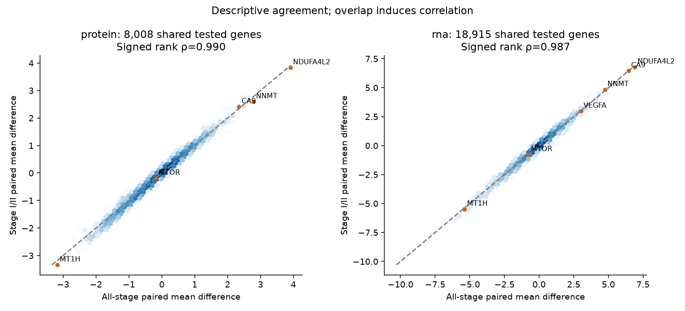

> Post-review correction by the parent analyst: VEGFA protein n=1 all-stage / n=0 early-stage. The plot label is now generated from frozen result rows. No estimates were changed or refitted. Original benchmark artifacts, review scores and token totals remain unchanged.

# Stage I/II sensitivity of paired ccRCC findings

Exploratory sensitivity report; independent scientific evaluation remains blocked.

**The main paired directions and the research shortlist persist descriptively in 37 early-stage cases. This is not independent replication, an interaction test, or proof of robustness.**

The original 72-case cross-modal cohort contains 28 Stage I, 9 Stage II, 23 Stage III and 12 Stage IV cases. Exact pathological stage labels from authoritative `input/clinical_annotation.csv` retain 37 Stage I/II cases and exclude 35 later-stage cases; no stage is missing in the original cohort. Original histology/contaminated-normal exclusions and the four-assay intersection remain unchanged. No cases were added from a larger single-layer cohort.

## Cohort-specific gene families

| Cohort | Cases | Minimum finite pairs | Protein tested / q<.05 | RNA tested / q<.05 |
|---|---:|---:|---:|---:|
| all_stage | 72 | 58 | 8,054 / 6,838 | 19,015 / 15,118 |
| stage_I_II | 37 | 30 | 8,087 / 6,436 | 18,915 / 14,077 |

Among 11,710 input proteins, 3,656 all-stage and 3,623 early-stage genes fail coverage. All 19,275 RNA genes meet coverage, but 260 all-stage and 360 early-stage genes have zero paired variance and are not tested. Four separate BH families include only successfully tested genes. Compared with the original 10,033-protein analysis, the new all-stage family drops 1,979 proteins due to coverage; original estimates for retained genes are unchanged, while BH q values are recalculated.

The estimator remains the arithmetic mean of finite paired tumor-minus-normal differences. Protein uses processed TMT log2 reference ratios; RNA uses supplied log2 FPKM. No additional transformation or imputation. Coverage is computed independently within each cohort: max(20, ceil(0.8 × N)) = 58 or 30 pairs. Two-sided paired t tests and nominal 95% intervals use SD of paired differences / sqrt(n) and t(n−1). These are paired intervals, not independent tumor/normal intervals. They assume independent cases and sufficiently regular paired-difference means; they are neither simultaneous nor adjusted for selection. BH control depends on the usual dependence conditions, which are not established here.

## Effect directions and rankings

| Layer | Shared tested | All-only / early-only tested | Same direction | Signed / absolute effect rank rho | Top-100 absolute overlap* |
|---|---:|---:|---:|---:|---:|
| protein | 8,008 | 46 / 79 | 95.83% | 0.990 / 0.971 | 83/100 |
| rna | 18,915 | 100 / 0 | 95.07% | 0.987 / 0.968 | 96/100 |

*Rank correlations and top-100 sets use the shared successfully tested universe for fair descriptive comparison; ranks concern mean effects, not p values. Family-change gene lists and full estimates are in `followup_tables/`.

For protein, among shared tested genes, 6,239 have q<.05 in both cohorts, 562 only in all-stage, and 138 only in early-stage. These counts mix changes in standard errors, observed effects and BH families. A difference in significance does not prove interaction, a biological stage difference, or robustness.
For rna, among shared tested genes, 13,628 have q<.05 in both cohorts, 1,490 only in all-stage, and 449 only in early-stage. These counts mix changes in standard errors, observed effects and BH families. A difference in significance does not prove interaction, a biological stage difference, or robustness.

Within-cohort RNA/protein direction agreement is 76.71% across 7,638 all-stage genes and 75.67% across 7,670 early-stage genes; descriptive cross-layer rank rho is 0.715 and 0.707. Exact same finite cases across all four assays give 76.71% and 75.75% agreement. These use different gene universes and distinct assay scales; no equality of cross-layer effects is inferred.

## Four prespecified genes and frozen exploratory shortlist

CA9 and NNMT remain higher in both layers. MTOR total abundance remains lower in both layers; this does not establish reduced kinase activity. VEGFA RNA remains higher, while protein has one finite pair all-stage and zero early-stage and no valid test or interval. The two original data-selected genes, NDUFA4L2 (current UniProt COXFA4L2) and MT1H, retain their upward/downward directions. Reapplying the original selection rule (non-prespecified proteins, >=90% finite pairs, q<.05, largest absolute mean, alphabetical ties) selects them in ranks 1 and 2 in both cohorts. This selection result is exploratory and subject to winner bias; early-stage data overlap the data that selected them.

| Gene | Layer | Cohort | n | Mean Δ [95% CI] | p | BH q | Abs-effect rank |
|---|---|---|---:|---|---:|---:|---:|
| CA9 | protein | all_stage | 72 | 2.34 [2.18, 2.51] | 6.21e-41 | 1.35e-38 | 26 |
| NNMT | protein | all_stage | 72 | 2.78 [2.59, 2.98] | 5.85e-41 | 1.35e-38 | 10 |
| VEGFA | protein | all_stage | 1 | not tested | — | — | — |
| MTOR | protein | all_stage | 72 | -0.175 [-0.212, -0.137] | 5.44e-14 | 1.36e-13 | 5.19e+03 |
| NDUFA4L2 | protein | all_stage | 72 | 3.91 [3.69, 4.13] | 4.77e-47 | 3.84e-43 | 1 |
| MT1H | protein | all_stage | 72 | -3.18 [-3.51, -2.85] | 4.49e-30 | 5.5e-29 | 2 |
| CA9 | rna | all_stage | 72 | 6.45 [6.2, 6.71] | 2e-57 | 1.23e-54 | 8 |
| NNMT | rna | all_stage | 72 | 4.74 [4.42, 5.06] | 6.84e-42 | 5.68e-40 | 44 |
| VEGFA | rna | all_stage | 72 | 3.01 [2.78, 3.24] | 3.41e-38 | 1.53e-36 | 195 |
| MTOR | rna | all_stage | 72 | -0.778 [-0.844, -0.713] | 1.99e-35 | 5.91e-34 | 3.61e+03 |
| NDUFA4L2 | rna | all_stage | 72 | 6.91 [6.66, 7.16] | 2.86e-60 | 3.02e-57 | 6 |
| MT1H | rna | all_stage | 72 | -5.39 [-5.84, -4.93] | 2.86e-35 | 8.28e-34 | 24 |
| CA9 | protein | stage_I_II | 37 | 2.41 [2.18, 2.64] | 3.67e-22 | 7.07e-20 | 26 |
| NNMT | protein | stage_I_II | 37 | 2.59 [2.33, 2.86] | 4.32e-21 | 3.79e-19 | 17 |
| VEGFA | protein | stage_I_II | 0 | not tested | — | — | — |
| MTOR | protein | stage_I_II | 37 | -0.188 [-0.241, -0.135] | 2.03e-08 | 5.09e-08 | 5.21e+03 |
| NDUFA4L2 | protein | stage_I_II | 37 | 3.83 [3.5, 4.16] | 1.5e-23 | 9.16e-21 | 1 |
| MT1H | protein | stage_I_II | 37 | -3.34 [-3.83, -2.86] | 4.43e-16 | 4.04e-15 | 2 |
| CA9 | rna | stage_I_II | 37 | 6.46 [6.04, 6.87] | 7.19e-28 | 1.48e-25 | 10 |
| NNMT | rna | stage_I_II | 37 | 4.84 [4.39, 5.29] | 1.73e-22 | 9.61e-21 | 45 |
| VEGFA | rna | stage_I_II | 37 | 2.97 [2.63, 3.31] | 2.76e-19 | 6.37e-18 | 221 |
| MTOR | rna | stage_I_II | 37 | -0.775 [-0.86, -0.69] | 5.64e-20 | 1.63e-18 | 3.76e+03 |
| NDUFA4L2 | rna | stage_I_II | 37 | 6.79 [6.35, 7.23] | 8.58e-28 | 1.71e-25 | 6 |
| MT1H | rna | stage_I_II | 37 | -5.48 [-6.18, -4.79] | 6.37e-18 | 1.01e-16 | 25 |

All testable shortlist leave-one-out means retain their direction. Medians, skew and leave-one-out ranges are saved in `followup_results.json`; this limited influence check does not establish distributional assumptions for every gene.

## Bounded registered-trial evidence

Actual MCP ClinicalTrials.gov API v2 retrieval on 2026-09-24 used two concepts: kidney cancer + girentuximab and kidney cancer + NNMT (intervention field). Girentuximab was verified in the reused CA9 Open Targets snapshot and ARISER literature before use. No unverified aliases were introduced. One page (maximum 20 records) per concept was retrieved, followed by four selected full trial records. The girentuximab page reports 20 returned / total 20 but also supplies a next-page token; no exhaustive coverage is claimed. NNMT returned zero: this is an unsuccessful bounded literal search, not proof that no relevant trials exist. No NNMT agent was verified in the prior source artifacts.

| Registry record | Purpose / relevance | Phase | Source-reported status | Last update posted / status verified | Posted results |
|---|---|---|---|---|---|
| [NCT00087022](https://clinicaltrials.gov/study/NCT00087022) | Treatment: ARISER, adjuvant antibody after nephrectomy in high-risk disease | PHASE3 | COMPLETED | 2018-11-27 / 2018-10 | Yes |
| [NCT03849118](https://clinicaltrials.gov/study/NCT03849118) | Diagnostic imaging: ZIRCON, 89Zr-girentuximab PET/CT in indeterminate renal masses | PHASE3 | COMPLETED | 2024-05-17 / 2024-05 | Yes |
| [NCT05239533](https://clinicaltrials.gov/study/NCT05239533) | Treatment with imaging components: 177Lu-girentuximab + nivolumab, advanced ccRCC | PHASE2 | ACTIVE_NOT_RECRUITING | 2026-01-14 / 2026-01 | No |
| [NCT05663710](https://clinicaltrials.gov/study/NCT05663710) | Treatment: 177Lu-girentuximab + cabozantinib + nivolumab, advanced ccRCC | PHASE1 / PHASE2 | RECRUITING | 2026-07-30 / 2026-04 | No |

ZIRCON is a diagnostic study, with sensitivity/specificity against histology as its primary outcome; phase 3 and completion do not imply treatment efficacy. The advanced-disease combination trials are treatment research with no posted results in the retrieved snapshots; their status/phase and planned outcomes establish neither efficacy nor applicability to this early-stage tissue cohort. ARISER has posted results; the unchanged retrieved publication (PMID 27787547) reported no significant DFS advantage (HR 0.97, 95% CI 0.79–1.18) or OS advantage (0.99, 0.74–1.32). This limits extrapolation from CA9 tissue contrast to adjuvant benefit. Registry dates are source-reported and can be stale; retrieval date is not the status-verification date.

Prior UniProt/Open Targets annotations and literature were reused without new requests. Kim et al. (PMID 41399267), a separate 14-patient paired RNA study with cell-line experiments, supports NNMT biological follow-up, not human efficacy. Independence of reused public multiomics data in Wang et al. (PMID 42440812) remains unresolved. No candidate-specific literature was newly obtained for NDUFA4L2 or MT1H. Original Clark/CPTAC findings are not independent replication. Full URLs, original snapshots, new raw responses, hashes, source dates and trial outcomes are indexed in `context_sources.json`; no registry outcome effect was newly estimated.

## Reuse, validation and continuation

All nine input hashes and sizes were verified before memory retrieval or estimation; exact fingerprint: `ff08dba38c4df7e1f899b4ebecb713f6aa49d24cb074d9f9c30478a1e1571f0f`. Six original decisions were usable with no issues (4,462 UTF-8 context bytes, not tokens). Record IDs and selected keys are in `followup_memory_retrieval.json`. Retrieved cohort, scales, missingness, estimator and shortlist fields were checked against `analysis_config.json` before driving the follow-up config and cohort validation. Original code was read for method compatibility but not executed. Saved original cohort IDs, results, validation, controller, annotation and literature snapshots were reused. The original continuation note is copied byte-for-byte to `followup_initial_notes.md`.

Rerun statistics: four cohort/layer paired estimates, intervals, p values and within-family BH; family/direction/rank comparisons; shortlist selection and leave-one-out diagnostics; cross-layer exact-finite-case directional sensitivity. Rerun source requests: exactly two native MCP trial searches and four trial-detail requests. Original analysis, annotation requests and literature searches were not rerun. All-stage means were checked against saved originals; BH in all four families was checked with SciPy and all testable shortlist intervals/tests with a separate SciPy calculation. Both actual new PNGs were visually inspected. Original report.html/results.json/figures and other initial scientific artifacts were hash-checked unchanged.

Offline reproduction: `/tmp/biostat-rhc-analysis-env/bin/python followup_analysis.py` then `/tmp/biostat-rhc-analysis-env/bin/python followup_report.py`. This reuses frozen source snapshots and performs no network requests. Full gene tables are separate in `followup_tables/`; figures in `followup_figures/`. Runtime path and package versions are saved. The controller records actual follow-up stages and blocks evaluation; no human or independent approval was invented. A separately named sensitivity memory decision is appended with analyst attribution, leaving original decisions valid.

## Unresolved limitations and next review

Serious: common-assay selection and abundance-dependent missingness may select observed pairs; the 80% rule does not resolve MNAR. Stage restriction changes the target population and precision; with 37 overlapping cases it is not an independent replication. Batch, purity, tissue composition, TMT compression and adjacent-normal biology remain unresolved. Nominal inference does not adjust for selecting the shortlist; correlation and direction agreement are descriptive, not evidence of stage invariance or causal mechanism. No formal stage-interaction, equivalence, clinical efficacy or causal analysis was conducted.

Next: independent artifact/code review; assess stage-specific missingness, batch and purity; validate the frozen candidates using independent specimens and orthogonal assays; review full clinical publications before interpreting therapeutic relevance. Registry coverage is bounded and NNMT name/agent coverage incomplete. Technical checks and this same-session methodological review do not resolve these scientific gates.

Existing followup_memory_retrieval.json was refreshed for this session; its previous hash remains in followup_preservation.json. The original FOLLOWUP.md is archived at followup_initial_notes.md. Original scientific outputs remain byte-identical. To finalize provenance after an intentional rerun, use followup_finalize.py; this records an analyst-attributed sensitivity decision and does not grant independent review.
