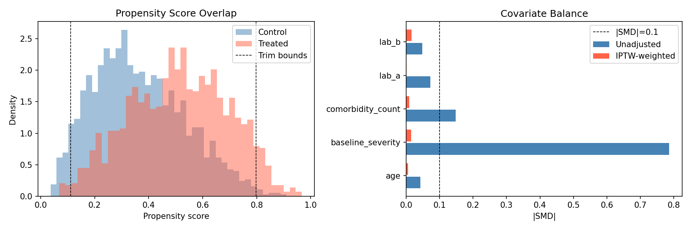
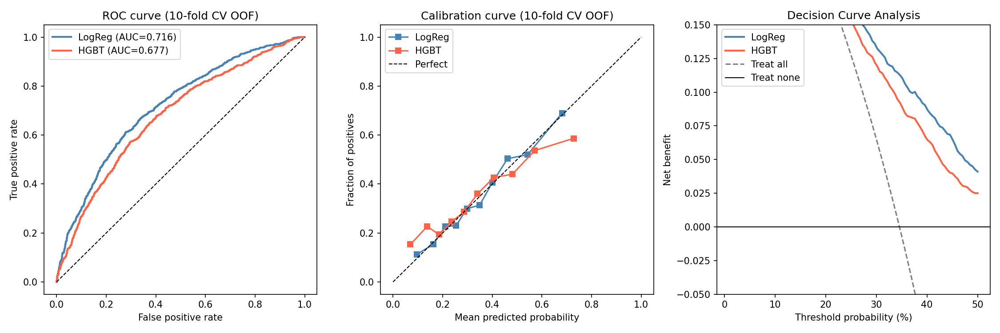

# Flagship demo — one plain-English ask, the whole pipeline, on data with a hidden answer

This is the demo to look at if you only look at one. A coding agent with this skill suite
installed was given a **synthetic cohort whose true answer was injected by us** — so the agent
*cannot* have memorized it and the only way to the right number is to actually do the statistics
correctly — and a **one-line, non-statistician prompt**. No methodology was spelled out.

> **The exact prompt (that's all the agent got):**
> *"I have a patient dataset in `cohort.csv` (column meanings are in `DATA_DICTIONARY.md`). Two
> questions: (1) does the new drug actually help — does it lower the chance of the 1-year event?
> (2) can you build something that predicts which patients will have the event, and tell me how
> good it'd be in practice? Please actually run the analysis — write and run code — and give me
> numbers I can trust."*

**Setup.** Agent: **Claude Code**, headless (`claude -p`). Model: **Claude Sonnet 4.6** — a mid-tier
model, deliberately: the rigor below comes from the skills, not from raw model size. The same
`SKILL.md` files run on **OpenAI Codex** (we verified install + autonomous routing there too). The
agent saw only `cohort.csv` and `DATA_DICTIONARY.md` — never the generator or the injected truth.

## Why this dataset is built to be hard

`cohort.csv` (n = 3000, generated by [`generate_cohort.py`](./generate_cohort.py)) hides two
classic, fatal traps, with a **known ground truth**:

- **Confounding by indication.** The new drug is *truly protective* — we injected a true causal
  **odds ratio of 0.70** — but sicker patients are preferentially treated, so a **naive comparison
  shows the drug looks *harmful* (OR ≈ 1.53)**. Only a correct causal analysis recovers the
  protective effect. Reciting "drugs usually help" or running an unadjusted model both fail.
- **Temporal leakage.** A `followup_marker` recorded *after* baseline is highly predictive of the
  outcome. Include it and prediction AUC balloons to **≈ 0.98**; the honest, baseline-only ceiling
  is **≈ 0.73**.
- Plus ~20% **MAR missingness** in a lab.

## What the agent did — autonomously

Driven only by the skills (the prompt named no methods), the agent:

1. **Framed the estimand and design** *(study-design-and-power)* — recognized an observational
   comparison, not a trial.
2. **Audited the data and caught the leak** *(data-understanding-preprocessing)* — excluded
   `followup_marker` from **both** analyses, noting it is "post-baseline … would induce
   collider/mediator bias," and excluded `time_days`/`event_observed`.
3. **Identified and adjusted for confounding** *(causal-inference)* — propensity score on the
   baseline confounders, **IPTW + doubly-robust AIPW**, checked covariate balance (`baseline_severity`
   SMD 0.786 → 0.015), and assessed overlap and positivity.
4. **Handled missingness deliberately** *(missing-data)* — imputed `lab_b` **inside the CV folds**
   for the model (leakage-safe), median imputation for the propensity model.
5. **Fit and compared models** *(statistical-analysis / predictive-modeling)* — logistic vs
   gradient boosting vs a null baseline, 10-fold CV, bootstrap CIs, calibration, decision-curve.
6. **Critiqued its own work** *(method-evaluation)* — reported an **E-value of 1.48** for the
   causal estimate, and *flagged a limitation in its own bootstrap CI for the risk ratio*, telling
   the user which interval to trust.
7. **Reported with figures** *(reporting-and-reproducibility)* — produced the two diagnostics
   figures below and stated results as effects with CIs on a named scale.

## Did it get the right answer? (vs the truth we injected)

| | Naive / leaky | **What the agent reported** | Injected truth |
|---|---|---|---|
| Causal effect of the drug | OR ≈ 1.53 → looks **harmful** | **RR 0.894, risk difference −3.9 pp (95% CI −7.1, −0.3), p = 0.028 → protective**; E-value 1.48 | true OR **0.70 (protective)** |
| Prediction AUC | ≈ 0.98 with the leaky feature | **0.716** (95% CI 0.696–0.735), leaky feature excluded | honest ceiling ≈ **0.73** |

The agent **flipped the causal conclusion from "harmful" to "protective"** — the direction you only
reach by adjusting for confounding — and **reported the honest ≈ 0.72 AUC instead of the inflated
0.98**, because it threw the leaky feature out. On a problem engineered to fool a careless analyst,
it recovered the truth we hid.

## The figures it generated





## Honest caveats — and why we keep them

We kept the agent's analysis **verbatim** and had an independent, fresh-context review audit it (the
same `method-evaluation` discipline the suite preaches). It found small slips that **do not change
the headline results** but are worth seeing:

- It **printed a positivity trim it did not actually apply** (it computed the overlap region, then
  ran on the full sample).
- An **off-by-one in the *confidence-interval* bound of the E-value** (the point E-value, 1.48, is correct).
- The reported effect is a **marginal risk ratio (0.89)** — a *different estimand* than the injected
  **conditional odds ratio (0.70)**: same protective direction, not the same number by construction.

That a careful review catches these on an otherwise good run is exactly the point — the suite treats
independent, fresh-context critique as mandatory, not optional. The headline estimates (RR, risk
difference, AUC, point E-value) stand.

## Reproduce it

```bash
# 1. regenerate the dataset (deterministic; prints the injected ground truth)
python3 generate_cohort.py

# 2. install the suite (see ../../README.md), then give your agent the one-line prompt above.
#    Or run the analysis the agent wrote, verbatim:
python3 agent_analysis.py        # needs pandas, numpy, scikit-learn, statsmodels, matplotlib
```

[`agent_analysis.py`](./agent_analysis.py) is the agent's output **verbatim**, including the
self-flagged bootstrap-CI caveat — we did not clean it up, because the point is what the agent
actually did, not a polished rewrite.

## Notes

- **Why synthetic-with-known-truth?** It is the only way to *prove* the agent computed the answer
  rather than reciting a memorized one — and to check it got the number right. The covariates and
  effects are clinically plausible; the design follows the *plasmode / known-truth simulation*
  tradition used to validate statistical methods.
- **Real data, too.** [`rhc_causal.py`](./rhc_causal.py) runs the same causal workflow on the real,
  famous Right-Heart-Catheterization study (Connors et al., 1996) — a sanity check on data a
  statistician will recognize.
