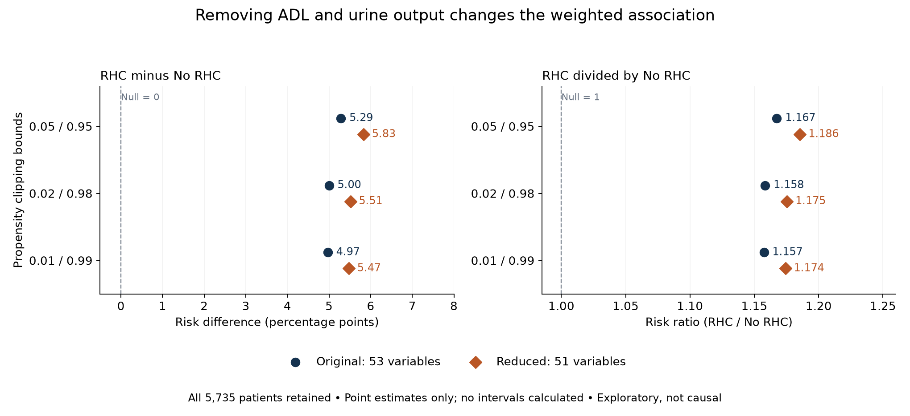

# RHC follow-up: removing ADL and urine output

Excluding adld3p and urin1 increased the estimated positive association at every clipping threshold. The RD increased by 0.50 pp at 0.01, 0.51 pp at 0.02, 0.54 pp at 0.05. Removing the variables worsened balance on median-imputed ADL: absolute SMD rose from about 0.039 to 0.165–0.166 across thresholds. Urine-output SMD rose from 0.033–0.038 to 0.080–0.086. Retained-term maximum SMDs remained below 0.07 in the reduced model. This diagnostic does not validate deletion or resolve bias from missing values.

Deleting potential confounders is a sensitivity exercise, not a repair that establishes causal validity. No new confidence intervals are available, so these point-estimate changes do not establish a statistically distinguishable difference. No user scientific approval or causal readiness is implied.

| Clip c | Adjustment | RHC risk (%) | No RHC risk (%) | RD (pp) | RR |
| --- | --- | --- | --- | --- | --- |
| 0.01 | original | 36.53 | 31.56 | 4.97 | 1.157 |
| 0.01 | reduced | 36.91 | 31.43 | 5.47 | 1.174 |
| 0.02 | original | 36.56 | 31.56 | 5.00 | 1.158 |
| 0.02 | reduced | 36.94 | 31.43 | 5.51 | 1.175 |
| 0.05 | original | 36.85 | 31.56 | 5.29 | 1.167 |
| 0.05 | reduced | 37.25 | 31.42 | 5.83 | 1.186 |

## Methods

Both specifications retain all 5,735 patients (2,184 RHC; 3,551 No RHC), with 830 and 1,088 recorded deaths respectively. Original adjustment uses 53 variables; reduced adjustment uses exactly the same set except adld3p and urin1 (51 variables). All other column order, encoding, imputation, scaling, logistic model settings and risk calculations match the saved analysis. Cat2 remains included. Numeric missing values use cohort medians (zero fallback), and categorical missingness maps to the reference level. The logistic model uses standardized predictors, C=1.0 and max_iter=5000 with unchanged library defaults. Propensities are clipped symmetrically to [c,1-c]; stabilized inverse-propensity weights are normalized within exposure groups to calculate risks. Clipping changes weights, not cohort membership.

adld3p: 4,296/5,735 missing (74.9%); urin1: 3,028/5,735 missing (52.8%); cat2: 4,535/5,735 missing (79.1%).

## Reuse and provenance

Reused decision_log.md decisions 2–3 and 5–9, report.md limitations, results.json cohort counts/software versions/point-estimate benchmarks, analysis.py exact design/propensity/weights/contrast/balance functions and excluded-column list, input/SOURCE.md attribution and analysis-input fingerprint, and selected local dictionary entries. The original report.html and five figures were fingerprinted for preservation; their analyses were not rerun wholesale. Local dictionary text required cp1252 decoding after a UTF-8 read failed. Source attribution (Vanderbilt SUPPORT/RHC; Connors et al., JAMA 1996, PMID 8782638) is inherited, not newly externally verified.

Verified analysis-input SHA256: `811bad3c113c26acc64c00ed149993b09dd320cf2540b750738f5656233d2ec6`.

## Operations rerun

Actually reran SHA256 verification before model reuse, cohort/ID/exposure/outcome/count checks, missingness counts for the three named fields, both propensity fits, six sets of weights and weighted risks/RD/RR, clipping counts, weight maxima, Kish effective sample sizes and balance diagnostics. Verified identical retained design columns, software versions and reproduction of all three saved original point-estimate specifications to tolerance 1e-10. No bootstrap or intervals were computed; old intervals are not reused. Initial discovery, broad date audits, Table 1, original figures, alternative missingness models and restricted-history models were not rerun.

## Remaining uncertainty and next steps

- Potential confounder deletion may increase residual confounding; neither specification is a justified sufficient adjustment set.
- Within-day exposure/covariate ordering, eligibility and early-event selection remain unresolved.
- Single median imputation and categorical reference-level missingness encoding remain; MAR/MNAR and cat2 structural missingness are unverified.
- Prior audit flagged 11 recorded survivors with last contact before day 30; outcome ascertainment remains unresolved.
- No new confidence intervals, bootstrap, multiple imputation or MNAR analysis; no statistical significance claim about estimates or their differences.
- Balance and finite weights cannot establish causal identification or structural positivity. No human scientific approval or independent review is implied.

Before causal analysis: recover timing and eligibility rules, clarify ascertainment and cat2 missingness, establish a clinically justified adjustment set, and design appropriate missing-data sensitivity and inference.

## Reproduce

Run `/tmp/biostat-rhc-analysis-env/bin/python followup_analysis.py` from this folder. No dependencies installed; no network, MCP, runtime, SQLite or other study arms used. Model work was not delegated. Outputs: followup.html, FOLLOWUP.md, followup_results.json, followup_comparison.png, followup_balance.csv and context_sources.json.

## Weighting diagnostics

| Clip | Adjustment | Clipped n | Max weight | ESS RHC | ESS No RHC | Max SMD retained | ADL SMD | Urine SMD |
| --- | --- | --- | --- | --- | --- | --- | --- | --- |
| 0.01 | original | 20 | 20.73 | 1122 | 2131 | 0.070 | 0.039 | 0.038 |
| 0.01 | reduced | 13 | 21.24 | 1114 | 2158 | 0.065 | 0.166 | 0.086 |
| 0.02 | original | 85 | 19.04 | 1140 | 2132 | 0.070 | 0.039 | 0.038 |
| 0.02 | reduced | 72 | 19.04 | 1137 | 2158 | 0.065 | 0.166 | 0.085 |
| 0.05 | original | 424 | 12.38 | 1254 | 2317 | 0.072 | 0.039 | 0.033 |
| 0.05 | reduced | 403 | 12.38 | 1251 | 2338 | 0.067 | 0.165 | 0.080 |

SMDs use the fixed original imputed/encoded matrix; good balance cannot establish identification. Omitted-variable diagnostics use median-imputed values and do not resolve their missingness.
