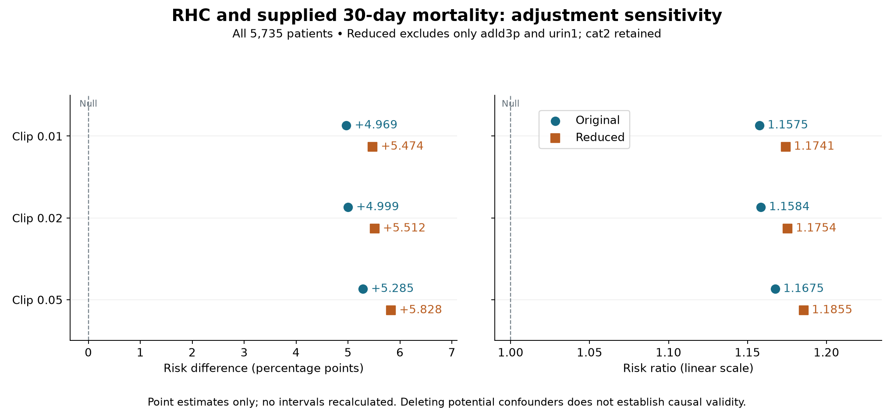

# RHC follow-up: omit adld3p and urin1

Excluding adld3p and urin1 increases the exploratory propensity-weighted association at every clipping threshold. The risk difference rises by 0.505–0.543 percentage points and the risk ratio by 0.0167–0.0180. All 5,735 patients remain (2,184 RHC; 3,551 No RHC).

Deleting potential confounders is a sensitivity exercise, not a repair that establishes causal validity. These are associations with supplied 30-day mortality, not causal effects. No confidence intervals were calculated for this follow-up, and no prior intervals are reused. Differences between specifications have no calculated uncertainty.

| Clip | Original RD (pp) | Reduced RD (pp) | Δ RD (pp) | Original RR | Reduced RR | Δ RR |
| --- | --- | --- | --- | --- | --- | --- |
| 0.01 | 4.969 | 5.474 | +0.505 | 1.1575 | 1.1741 | +0.0167 |
| 0.02 | 4.999 | 5.512 | +0.513 | 1.1584 | 1.1754 | +0.0170 |
| 0.05 | 5.285 | 5.828 | +0.543 | 1.1675 | 1.1855 | +0.0180 |

| Specification | Clip | RHC risk (%) | No RHC risk (%) | Clipped n | Max weight | ESS RHC / No RHC | Max |SMD| |
| --- | --- | --- | --- | --- | --- | --- | --- |
| original | 0.01 | 36.526 | 31.557 | 20 | 20.73 | 1122.0 / 2131.3 | 0.070 |
| original | 0.02 | 36.556 | 31.557 | 85 | 19.04 | 1140.0 / 2131.5 | 0.070 |
| original | 0.05 | 36.847 | 31.562 | 424 | 12.38 | 1254.2 / 2317.4 | 0.072 |
| reduced | 0.01 | 36.906 | 31.432 | 13 | 21.24 | 1113.7 / 2157.9 | 0.166 |
| reduced | 0.02 | 36.945 | 31.432 | 72 | 19.04 | 1136.9 / 2158.1 | 0.166 |
| reduced | 0.05 | 37.247 | 31.419 | 403 | 12.38 | 1250.5 / 2338.3 | 0.165 |

## Adjustment and estimation

Only adld3p (4,296 missing; 74.9%) and urin1 (3,028 missing; 52.8%) were removed. cat2 remains, including its original missing-value encoding (4,535 missing; 79.1%). Original versus reduced specifications use 53 versus 51 raw adjustment variables and 72 versus 70 encoded terms. Both use the same exclusions, first-category dummy coding with no missing category, numeric median filling followed by zero fallback, standardization, and L2 logistic propensity regression (C=1, lbfgs, max_iter=5000). No missingness indicators, interactions, new exclusions or outcome models were added. Each propensity model was fitted once; its scores were clipped to [c, 1−c] for each c. Stabilized inverse-probability weights use the observed exposure prevalence and weighted risks are normalized within exposure groups. Clipping changes scores, not cohort membership. RD is RHC risk minus No RHC risk; RR is RHC risk divided by No RHC risk.

## Diagnostics

Original versus reduced propensity fits converged without warnings. Balance is assessed on the same 72 original encoded/imputed terms using fixed unweighted pooled standard deviations. At clip 0.02, adld3p |SMD| rises from 0.039 to 0.166 and urin1 from 0.038 to 0.085. The reduced model leaves one original term above 0.10 at every threshold; the original leaves none. Full term-level diagnostics are in followup_balance.csv. Stronger clipping reduces the maximum weight but also changes the estimated association; none of these thresholds is selected as causally preferred.

## Saved context reused

Retrieved the four analysis-stage MemoryStore records scope, timing, profile and source before estimation. Their source files guided inspection of the contract, original functions, saved estimates, workflow gates, MCP profile and PMID 8782638 literature artifact. The original pure design/fit/calc functions were extracted from analysis.py without executing its top-level analysis. Input CSV, dictionary, legacy script and contract reproduce the saved composite fingerprint. All non-database entries in the initial artifact manifest were checked against their hashes. MCP artifacts remain exploratory/unreviewed; the original CSV staging metadata explicitly says its host-supplied source reference was not independently verified. No unchanged source was refetched, and no new MCP tool call was needed.

## Operations rerun

Actually rerun: SHA-256 checks and MemoryStore retrieval; unique-patient and exposure/outcome label checks; relevant missingness counts against the saved MCP profile; two full preprocessing/propensity fits; six clipping/weight/risk calculations; effective sample size, extreme-weight and all-original-term balance checks; original point-estimate comparison (agreement within 1e-10); controller transitions for a new bounded sensitivity run; figure generation and visual inspection. No bootstrap, multiple imputation, crude analysis, conditional outcome model, literature discovery or causal identification analysis was rerun.

## Unresolved gates and uncertainty

The original stopped causal workflow is preserved: within-day treatment/covariate chronology, eligibility/time-zero and grace-period alignment remain unresolved. Missing-data mechanisms, structural cat2 blanks, clinical sentinel values, an adequate causal adjustment set and exchangeability remain unestablished. Deletion can increase residual confounding and does not resolve these questions. The imputed-variable balance checks do not assess unobserved values or prove exchangeability. Site-aware uncertainty and uncertainty in the change between models are unassessed. Next work requires timing/clinical adjudication, a defensible DAG, a justified missing-data and MNAR plan, and appropriate uncertainty estimation. Independent review remains pending; this is an analyst self-audit. No user scientific approval or causal readiness is implied.

## Provenance and memory audit

CSV SHA-256: 811bad3c113c26acc64c00ed149993b09dd320cf2540b750738f5656233d2ec6. Composite input/contract fingerprint: aec788f747388e40d6eacda72eaf237703d28b9014be42154e72be78aa63f61e. The first memory lookup used the raw CSV hash and returned four unavailable-key issues; reconstruction of the original composite fingerprint resolved them. The successful retrieval selected four keys with 2,070 UTF-8 context bytes, not model tokens, and no missing/stale/conflicting or omitted keys. Both attempts are retained in followup_memory_retrieval.json. The new sensitivity decision is attributed to the Codex analyst, with the user request as scope authorization only; see followup_memory_append.json. Its dependencies reference all four prior records. Existing records were not superseded. context_sources.json identifies files, record IDs and supporting checks.

## Reproduction and preserved outputs

Run `PYTHONPATH=/Users/amiee/Projects_code/biostat-superpowers /tmp/biostat-rhc-analysis-env/bin/python -B followup_analysis.py`, then `/tmp/biostat-rhc-analysis-env/bin/python -B build_followup_report.py`. No dependencies were installed. Initial report.html, results.json and all original figures retain their original hashes. The new HTML embeds its figure and styles for offline viewing. Figure visually inspected; HTML source checked, but no browser rendering test performed. Software versions and complete adjustment lists are in followup_results.json.
