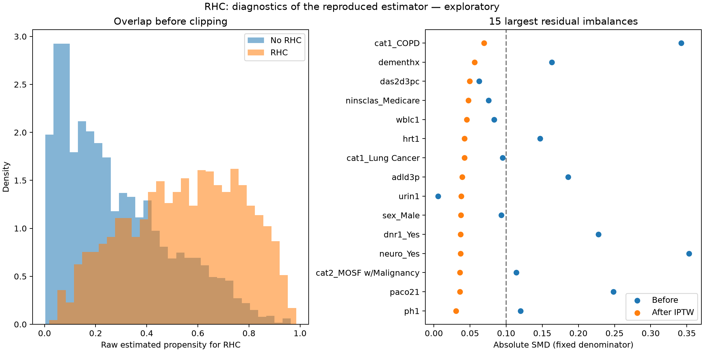

# RHC comparison results

Executed 2026-09-24T03:03:49.190525+00:00 using the installed v2 runtime at commit `dba3280`. Original script SHA-256: `fc039e567afc4adaf9446b82258279e10e7c336fc9827f18b36bd2f647dcae83`. Data SHA-256: `9ef4ab578be4b40ad5d97d3a7e08ffdc1f9f76aeeefee51b4996e4221556f8e8`. See [summary.json](summary.json) for exact values and package versions.

Both runs use the same frozen public dataset: **5,735 patients, 2,184 with RHC, 1,918 deaths within 30 days**. No rows were excluded. The original estimator and script were held fixed to isolate the added audit mechanics. This is not a fresh-model comparison or a reproduction of the 1996 paper's propensity-matched analysis.

| Quantity | Original-script reproduction | Instrumented reproduction |
|---|---:|---:|
| Crude mortality risk ratio | 1.2404 | 1.2404 |
| IPTW marginal risk ratio | 1.1584 | 1.1584 |
| IPTW marginal risk difference | +5.00 percentage points | +5.00 percentage points |
| Conditional adjusted odds ratio | 1.3668 | 1.3668 |
| Point-estimate E-value | 1.587 | 1.587 |
| RR exploratory percentile 95% interval | Not produced by original script | 1.053–1.273 |
| RD exploratory percentile 95% interval | Not produced by original script | +1.75 to +8.17 percentage points |

**Interpretation:** RHC is associated with higher adjusted 30-day mortality in this reproduced estimator. The additional intervals describe the inherited estimator under independent patient resampling, with its preprocessing and propensity fit repeated. They do not repair missing-data bias or establish a causal effect. All **500/500 resamples succeeded**, with no convergence warnings. The unchanged point estimates demonstrate reproducibility, not increased accuracy.

## What the added components actually contributed

| Component | Observed result | Limit |
|---|---|---|
| Controller | Recorded design/preparation handoffs, then a blocked missing-data checkpoint | Analyst-supplied results; no autonomous specialist execution; checkpoint is nonterminal |
| Memory | Persisted three input-bound records; successfully reopened; rejected a changed input fingerprint | Analyst facts/scope, not human approvals; retrieved content did not alter the estimator |
| MCP | Actual stdio calls fetched PubMed records 8782638 and 28693043 and built references with raw-source provenance | RHC CSV obtained by host, not an MCP dataset connector |
| Evaluation | Independent review identified missingness, timing, labeling and reporting gaps | Causal identification remains unresolved |
| Visualization | Added raw propensity overlap and per-covariate balance figure | Matplotlib host rendering; not an MCP chart invocation |
| Jev | Not installed or used | Deferred |

The original script reported mean absolute SMD 0.140 before and 0.018 after weighting. New diagnostics use a **fixed preweighting SD denominator**: maximum residual |SMD| is **0.070**, with **0 of 72 encoded covariates above 0.1**. This is measured mean balance, not complete distributional balance or causal identification.

**85 propensity scores were clipped** (83 no-RHC, 2 RHC); **zero patients were trimmed**. Effective sample sizes are approximately **2132 no-RHC** and **1140 RHC**. Changing clipping from none to 0.05 yields RR approximately 1.157–1.167 and RD +4.97 to +5.29 percentage points, retaining all patients. No preferred threshold was selected based on the treatment effect.

## Why the causal workflow remains blocked

ADL (`adld3p`) is missing in 4,296/5,735 records (74.9%); urine output (`urin1`) in 3,028/5,735 (52.8%). The old numeric median imputation does not resolve this inferential problem. Secondary diagnosis (`cat2`) has 4,535 blanks; whether these mean no secondary diagnosis or missing information needs adjudication.

The data archive describes both treatment and several covariates on day 1, without enough within-day ordering to establish the script's blanket pretreatment claim. A reviewed causal-role/timing specification and missing-data strategy remain necessary. The controller therefore keeps identification, analysis, evaluation and report readiness unset. These exploratory calculations do not approve or bypass that gate.

## Comparison limits and next work

No LLM token usage or cost telemetry was collected. Same-process script timings have unequal import/warm-up costs and exclude other workflow work; they are **not a speed benchmark**. This comparison does not demonstrate that memory saves tokens or that MCP improves statistical estimates. Further work: revised missing-data/timing specification, actual specialist execution with evaluation, and a separate controlled model experiment if quality/cost effects are the objective.

Source data courtesy of the Vanderbilt University Department of Biostatistics. [Data archive and permission](https://hbiostat.org/data/), [RHC variable documentation](https://hbiostat.org/data/repo/rhc.html), [Connors et al., 1996](https://pubmed.ncbi.nlm.nih.gov/8782638/), [VanderWeele and Ding, E-values](https://pubmed.ncbi.nlm.nih.gov/28693043/).
